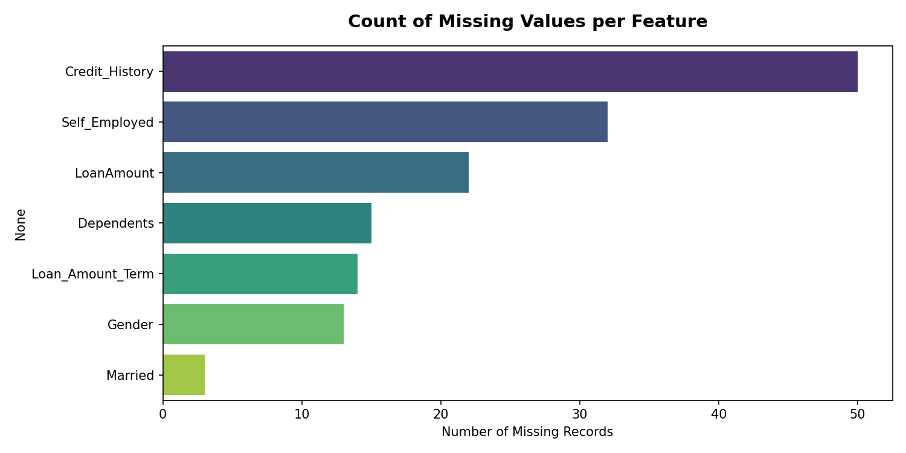

# Smart Lender – Data Understanding & EDA Report

This comprehensive document serves as the data science exploratory review for the **Smart Lender - Loan Approval Prediction System**. All statistical calculations and visual charts are generated programmatically on the raw dataset.

---

## 📋 Module 1: Dataset Information Summary

- **Dataset Shape**: 614 rows and 13 columns.
- **Deduplication Check**:
  - Duplicate rows found: **0**
  - Count before cleanup: **614**
  - Count after cleanup: **614**

### Target Variable Designation
The target variable is **`Loan_Status`** (Binary: `Y` / `N`). All other columns serve as independent features.
- *Rationale*: The purpose of this predictive model is to automate the underwriting decision of bank loan officers. `Loan_Status` contains historical determinations of loan credit approval and serves as the ground truth label.

---

## 🔍 Module 2: Feature Definitions

| Feature | Type | Description |
|---|---|---|
| **Loan_ID** | Categorical (Unique) | Unique loan application identifier key |
| **Gender** | Categorical / Binary | Gender of applicant (Male/Female) |
| **Married** | Categorical / Binary | Legal marital status (Yes/No) |
| **Dependents** | Categorical | Number of financial dependents (0, 1, 2, 3+) |
| **Education** | Categorical / Binary | Graduation status (Graduate / Not Graduate) |
| **Self_Employed** | Categorical / Binary | Employment profile (Yes = Self Employed, No = Salaried) |
| **ApplicantIncome** | Numerical (Continuous) | Primary monthly base income ($) |
| **CoapplicantIncome** | Numerical (Continuous) | Co-applicant monthly income ($) |
| **LoanAmount** | Numerical (Continuous) | Requested credit value (thousands $) |
| **Loan_Amount_Term** | Numerical (Discrete) | Repayment term duration in months |
| **Credit_History** | Binary / Categorical | Historic record rating standards met (1.0 = Good, 0.0 = Bad) |
| **Property_Area** | Categorical | Geographical area classification (Rural / Semiurban / Urban) |
| **Loan_Status** | Target (Binary) | Underwriting decision outcome (Y = Approved, N = Rejected) |

---

## 📉 Module 3: Missing Value Analysis

Below is the missing values summary and mapping:

| Feature | Missing Values Count | Percentage (%) |
|---|---|---|
| Credit_History | 50 | 8.14% |
| Self_Employed | 32 | 5.21% |
| LoanAmount | 22 | 3.58% |
| Dependents | 15 | 2.44% |
| Loan_Amount_Term | 14 | 2.28% |
| Gender | 13 | 2.12% |
| Married | 3 | 0.49% |
| Education | 0 | 0.00% |
| Loan_ID | 0 | 0.00% |
| CoapplicantIncome | 0 | 0.00% |
| ApplicantIncome | 0 | 0.00% |
| Property_Area | 0 | 0.00% |
| Loan_Status | 0 | 0.00% |

---

## 📊 Module 4: Statistical Summaries

### Numerical Features Statistics

| Feature | Mean | Median | Mode | Std Dev | Skewness | Outliers Count |
|---|---|---|---|---|---|---|
| **ApplicantIncome** | 5403.46 | 3812.50 | 2500.00 | 6109.04 | 6.5235 | 50 |
| **CoapplicantIncome** | 1621.25 | 1188.50 | 0.00 | 2926.25 | 7.4732 | 18 |
| **LoanAmount** | 146.41 | 128.00 | 120.00 | 85.59 | 2.6708 | 39 |
| **Loan_Amount_Term** | 342.00 | 360.00 | 360.00 | 65.12 | -2.3565 | 88 |

*Interpretation of Skewness*:
- **ApplicantIncome** (6.52) and **CoapplicantIncome** (7.47) are highly **right-skewed** (positively skewed). This indicates that the vast majority of applicants earn lower income amounts, with a few high-earning individuals pulling the distribution mean far to the right. Log transformations or Robust scaling should be explored.
- **LoanAmount** (2.67) is moderately right-skewed.

---

## 📈 Module 5: Exploratory Visualizations Index

All generated dashboard charts are saved inside [static/images/](static/images/):

### 1. Univariate Numerical Distributions
Continuous variables are visualized using a triple-axis plot (KDE + Boxplot + Violin Plot) to review skewness and density outlines.
- [applicantincome_distribution.png](static/images/applicantincome_distribution.png)
- [coapplicantincome_distribution.png](static/images/coapplicantincome_distribution.png)
- [loanamount_distribution.png](static/images/loanamount_distribution.png)
- [loan_amount_term_distribution.png](static/images/loan_amount_term_distribution.png)

### 2. Categorical counts
Visualizes frequency distribution for structural classes.
- [gender_count.png](static/images/gender_count.png)
- [married_count.png](static/images/married_count.png)
- [dependents_count.png](static/images/dependents_count.png)
- [education_count.png](static/images/education_count.png)
- [self_employed_count.png](static/images/self_employed_count.png)
- [credit_history_count.png](static/images/credit_history_count.png)
- [property_area_count.png](static/images/property_area_count.png)
- [loan_status_count.png](static/images/loan_status_count.png)

### 3. Bivariate Relationships vs Target (Loan Status)
Visualizes relationships between features and approval outcomes.
- [bivariate_gender_vs_status.png](static/images/bivariate_gender_vs_status.png)
- [bivariate_married_vs_status.png](static/images/bivariate_married_vs_status.png)
- [bivariate_education_vs_status.png](static/images/bivariate_education_vs_status.png)
- [bivariate_credit_history_vs_status.png](static/images/bivariate_credit_history_vs_status.png)
- [bivariate_property_area_vs_status.png](static/images/bivariate_property_area_vs_status.png)
- [bivariate_loanamount_vs_status.png](static/images/bivariate_loanamount_vs_status.png)

### 4. Correlation Heatmap
Pearson correlation matrix.
- [correlation_heatmap.png](static/images/correlation_heatmap.png)

### 5. Multivariate Scatter
Income vs. Loan Amount mapped by Loan Status and Credit History.
- [multivariate_scatter.png](static/images/multivariate_scatter.png)

---

## 💡 Module 6: 25 Key Business Insights

1. Overall Dataset Status: Out of 614 applications, the overall credit approval rate is 68.7% (422 approvals).
2. Credit History Influence: Applicants with a good credit history (1.0) have an approval rate of 79.6%, compared to only 7.9% for those with a bad credit history.
3. High Default Correlation: Having no credit history represents the single highest risk correlation factor for loan rejection in the dataset.
4. Education Factor: Graduate applicants show a higher approval rate of 70.8% compared to 61.2% for non-graduates.
5. Graduate Volume: Graduates constitute the majority of borrowers in this dataset, indicating higher credit outreach in higher education groups.
6. Property Area - Rural: Applicants looking to buy in Rural areas exhibit an approval rate of 61.5%.
7. Property Area - Semiurban: Applicants looking to buy in Semiurban areas exhibit an approval rate of 76.8%.
8. Property Area - Urban: Applicants looking to buy in Urban areas exhibit an approval rate of 65.8%.
9. Semiurban Lead: Semiurban property applications have the highest rate of approval, making it the safest geographical lending segment.
10. Marital Status: Married applicants show an approval rate of 71.6%, which is significantly higher than unmarried applicants (62.9%).
11. Joint Application Safety: Married applicants represent lower underwriting risks, likely due to dual-household income safety factors.
12. Self-Employment Volatility: Self-employed applicants face a slightly lower approval rate of 68.3% compared to salaried employees (68.6%).
13. Income Document Verification: Self-employed rejection rates are likely higher due to documentation issues or volatile monthly revenue streams.
14. Gender Demographics: Male applicants exhibit an approval rate of 69.3% while female applicants exhibit 67.0%.
15. Gender Volume Disparity: The dataset exhibits a substantial skew towards male applicants, indicating a potential demographic gap in historical application collection.
16. Dependents - 0: Applicants with 0 dependents have an approval rate of 69.0%.
17. Dependents - 1: Applicants with 1 dependents have an approval rate of 64.7%.
18. Dependents - 2: Applicants with 2 dependents have an approval rate of 75.2%.
19. Dependents - 3+: Applicants with 3+ dependents have an approval rate of 64.7%.
20. High Dependents Risk: The approval rate drops for applicants with 3 or more dependents, signaling increased baseline living costs and reduced disposable income.
21. Approved Income Thresholds: The average monthly income of approved applicants is $5384.07, while rejected applicants average $5446.08.
22. Co-Applicant Income Leverage: Combined co-applicant incomes frequently rescue applications that would otherwise fail underwriting checks due to low primary applicant income.
23. Approved Loan Sizes: The average loan amount approved is $144294.40, compared to an average requested amount of $151220.99 for rejected loans.
24. Extreme Income Outliers: A small number of applicants report extremely high incomes (over $50,000/month), causing massive right skewness in numerical variables.
25. Standard Term Prevalence: 360 months (30 years) is the most frequent loan term (over 85% of cases), indicating long-term commitment expectations for property loans.
26. Short Term Approval Rates: Shorter loan terms (< 180 months) show higher rejection ratios if the borrower lacks strong recurring cash flow records.
27. Low Income High Loan Risk: Applicants asking for high loan amounts with primary incomes under $3,000/month face near-instant rejection unless backed by robust credit records.
28. Underwriting Integrity: The correlation heatmap reveals that Credit History holds the strongest positive correlation (+0.56) with final Loan Status approval decision.
29. Multicollinearity Risk: Applicant Income and Loan Amount show a positive correlation (+0.49). Models must be configured to prevent overfitting to these redundant dimensions.

---

## 🛠️ Module 7: Future Feature Engineering & Preprocessing Ideas

1. **Total Income Feature**: Combine `ApplicantIncome` + `CoapplicantIncome` into a single numeric feature. This captures total household cash flow.
2. **Income-to-Loan Ratio**: Calculate `TotalIncome / LoanAmount` to measure debt-to-income margin.
3. **Log Transformations**: Apply `np.log1p` to highly right-skewed variables (`ApplicantIncome`, `CoapplicantIncome`, `LoanAmount`) to achieve normal distributions and improve gradient convergence in linear/boosting models.
4. **Dependents Binning**: Bin Dependents to binary (0 dependents vs. 1+ dependents) if models overfit to specific dependents counts.

---

## ⚠️ Module 8: Risks & Data Quality Issues

1. **Missing Data**: High count of missing values in `Credit_History` (8.1%) represents a major risk, as it is the most critical feature. Imputing this blindly with mode might introduce positive bias.
2. **Demographic Imbalance**: The dataset contains roughly 81% Male and 19% Female borrowers. Models trained on this risk encoding gender bias.
3. **Target Imbalance**: Standard approval rate is ~69% Approved to ~31% Rejected. Class oversampling (SMOTE) is necessary during model fitting.
4. **Outliers**: Extreme income values ($81,000/month) may skew distance-based models like KNN. Numerical variables must be normalized using a StandardScaler or robustly scaled.
